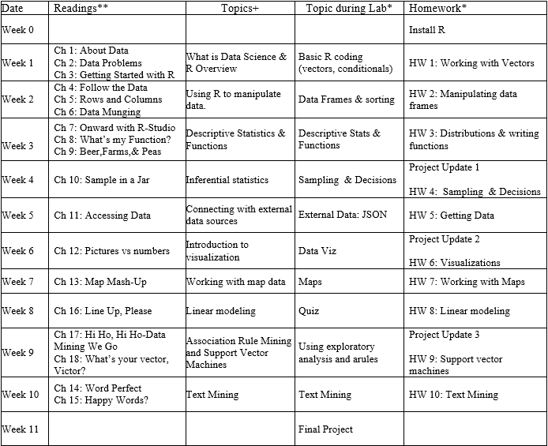

## Ryan Timbrook (Graduate Student - Course Work Repository)
**[LinkedIn Profile](https://www.linkedin.com/in/ryantimbrook/)**

## [Syracuse University, Masters of Applied Data Science](https://ischool.syr.edu/academics/graduate/masters-degrees/ms-in-applied-data-science/)

### IST687 Applied Data Science - Spring 2019
### SYLLABUS

                                   **SYRACUSE UNIVERSITY School of Information Studies**
                                           **IST687 Applied Data Science**     

**Course Description:** 
The course introduces students to applied examples of data collection, processing, transformation, management, and analysis to provide students with hands-on introduction to data science experience. Students will explore key concepts related to data science, including applied statistics, information visualization, text mining and machine learning. “R”, the open source statistical analysis and visualization system, will be used throughout the course. R is reckoned by many to be the most popular choice among data analysts worldwide; having knowledge and skill with using it is considered a valuable and marketable job skill for most data scientists. 

**Course Structure:**
During the synchronous section, you will have a chance to practice and apply you knowledge via an assignment that is due before the next synchronous session. Beyond the homework, there will also be a large project that is part of this course. This project will allow you to apply what you have learnt within the class to a real-world data problem. You will work within a team for this project, and be provided a real-world dataset. Your team’s task is to understand the domain and the data available to determine how to best provide insight and wisdom from all the data that might be available. 
 
**Learning Objectives:**
At the end of the course, students are expected to understand: 
* Essential concepts and characteristics of data  
* Scripting/code development for data management using R and R-Studio  
* Principles and practices in data screening, cleaning, and linking 
* Communication of results to decision makers 
 
**At the end of the course, students are expected to be able to:**
* Identify a problem and the data needed for addressing the problem 
* Perform basic computational scripting using R and other optional tools  
* Transform data through processing, linking, aggregation, summarization, and searching 
* Organize and manage data at various stages of a project lifecycle 
* Determine appropriate techniques for analyzing data 
 
 Weekly Schedule:

[SYRACUSE UNIVERSITY School of Information Studies](https://ischool.syr.edu/)
